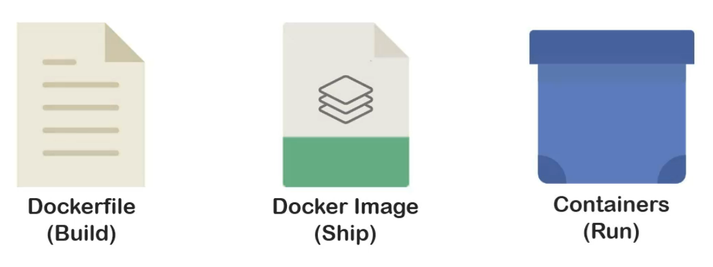

## Transcription

In previous module, we got introduced to containers and ran an instance of it. In this section, we will

dig deeper into the process of containerization with reference to Docker. Before understanding Docker in detail,

it will be efficient to visit a few terms briefly. Dockerfiles get built, docker images get shipped, and

containers are run. You can consider Dockerfile as blueprint of docker image.

If you remember well, we have already come across docker image and docker container in our nginx container

demo.

So now, that you know all of these three files definitely not in detail, but at least vaguely, we can move

on to the architecture of Docker and come back to these files later.