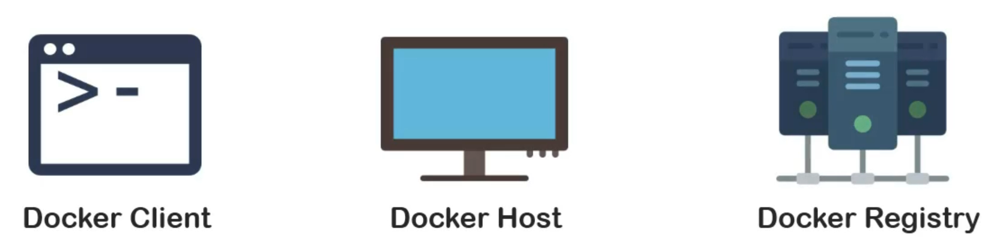

# Docker Engine
Also known as Docker in general and we'll look at other important ones as we move further with this course. Let's take a look at the architecture of Docker. Docker and the whole process of containerization revolves around three main components, Docker Client, Docker Host and Docker Registry.

## Docker Client
It's the machine or medium through which we as users interact with Docker. The two basic ways of interaction are:
1. **Docker CLI** which stands for command line interface
2. And **Docker APIs** which again stands for application program interface. Commands can be directly used from client terminal whereas APIs can be used to make some applications talk to Docker. (ex: `client.containers.run` and `client.containers.list`)

As we have seen in our earlier demo, both `docker pull` and `docker run` are commands covered under **Docker CLI**. We will explore more such commands as we cover further topics.

## Docker Host
Docker host is the machine which actually performs the task of containerization. It runs a program or piece of software called **"docker daemon"** which listens to and performs actions asked by Docker Client. Docker demon builds **Dockerfile** and turns it into docker image.

Dockerfiles and docker images can directly communicate with Docker daemon. Either images can be built from Dockerfile or they can be pushed or pulled from Docker Hub.

In any case, that task is to be performed by Doctor host using Docker demon. Docker images can also be run as containers. Containers can communicate with Docker daemon via docker images.

In other words, any changes made to the container are also reflected on the docker image temporarily.

We will explore these parts individually soon enough.

It is possible that Docker Client and Docker Host are actually the same machine as well. But the function of Docker Client as a piece of software is limited to passing the user input and displaying output provided from Docker Host.

## Docker Registry

You may find "Docker Registry" as the simplest component of the Docker architecture.

It serves as a place to store docker images and to make them available to others.

The nginx image which we used earlier in our demo was pulled from Docker Registry.

Docker Client talks to Docker daemon bi-directionally, where it passes the request and receives the results.

Whereas Docker daemon and Doctor Registry can talk bi-directionally to push and pull images.

Let's sum up all of these three components of Docker architecture.

1. First of all, we have Docker Client which passes requests through Docker CLI and APIs and receives results to be displayed.

2. Then, we have Docker Host which also runs Docker daemon and works with docker images and containers.

3. Finally, we have Docker Registry which acts as a universal place to access available docker images.

Now, we can go back to those three formats which we saw earlier. `Dockerfiles`, `Docker Images` and `Containers` which respectively represents **build**, **ship**, and **run**.

# Transcription

Now, the natural progression of thought would be how does Docker work?

Docker ecosystem has a number of offerings but some of them are more useful than the others.

We will begin with "Docker Engine" also known as Docker in general and we'll look at other important ones

as we move further with this course.

Let's take a look at the architecture of Docker. Docker and the whole process of containerization revolves

around three main components.

Docker Client, Docker Host and Docker Registry.

Docker Client is the machine or medium through which we as users interact with Docker. The two basic ways

of interaction are Docker CLI which stands for command line interface and Docker APIs which again

stands for application program interface. Commands can be directly used from client terminal whereas

APIs can be used to make some applications talk to Docker. As we have seen in our earlier demo, both

docker pull and docker run are commands covered under docker CLI. We will explore more such commands as we cover

further topics.

"Docker Host". Docker host

is the machine which actually performs the task of containerization.

It runs a program or piece of software called "docker daemon" which listens to and performs actions

asked by Docker Client. Docker demon builds Dockerfile and turns it into docker image. Dockerfiles and

docker images can directly communicate with Docker daemon. Either images can be built from Dockerfile or

they can be pushed or pulled from Docker Hub.

In any case, that task is to be performed by Doctor host using Docker demon. Docker images can also be

run as containers. Containers can communicate with Docker daemon via docker images.

In other words, any changes made to the container are also reflected on the docker image temporarily.

We will explore these parts individually soon enough. it is possible that Docker Client and Docker Host are actually the same machine as well. But the function of Docker Client as a piece of software is limited to passing the user input and displaying output provided from Docker Host. You may find "Docker Registry" as the simplest component of the Docker architecture.

It serves as a place to store docker images and to make them available to others.

The nginx image which we used earlier in our demo was pulled from Docker Registry.

Docker Client talks to Docker daemon bi-directionally, where it passes the request and receives the results.

Whereas Docker daemon and Doctor Registry can talk bi-directionally to push and pull images. Let's sum up

all of these three components of Docker architecture.

First of all, we have Docker Client which passes requests through Docker CLI and APIs and receives results

to be displayed.

Then, we have Docker Host which also runs Docker daemon and works with docker images and containers.

Finally, we have Docker Registry which acts as a universal place to access available docker images.

Now, we can go back to those three formats which we saw earlier. Dockerfiles, docker images and containers

which respectively represents build, ship, and run. In the next lecture, we will take a detailed look

at how Dockerfiles work.