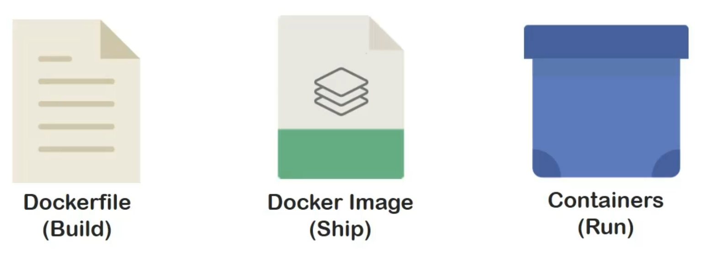

We can now go back to the three formats which we saw earlier. **Dockerfiles**, **Docker images**, and **Containers**. Which respectively present build, ship, and run.

# Dockerfile

First, let's focus on Dockerfile.

It is a sequence set of instructions intended to be processed by **Docker daemon**. Availability of such format replaces a bunch of commands intended for the build up of a particular image.

It helps keeping things organized. With time, it has also turned out to be the primary way of interacting with Docker and migrating to containers in general.

As for working, each sequential instruction of Dockerfile is processed individually and it results in a file which acts as a layer of the final docker image which will be built.

A stack of such sequenced layers, managed by a file system becomes a docker image.

The purpose behind this is to enable caching and ease up troubleshooting. If two Docker files are going to use the same layer at some stage, Docker deamon can just reuse the pre-created layer for such purposes.

# Dockerfile structure

Now, let's look at the structure used for writing the Dockerfiles.

Firstly, it is a file with no extension at all! And a general rule of thumb is to name the file as `Dockerfile` **with "D" capital and no extension**.

You can use any text editor to create the file. Just make sure you don't put an extension.

The purpose behind doing so is to make the file compatible to parse for auto builder used by docker to build the images.

Although it is not an ironclad rule and you can name the docker file according to your convenience as well which we will look in the future demos.

What you see inside the Dockerfile are instructions to be passed on. The instructions can be generally divided into three categories:
- Fundamental
- Configuration
- Execution instructions.

In next lectures, we will write our first Dockerfile and understand these instructions one by one.
