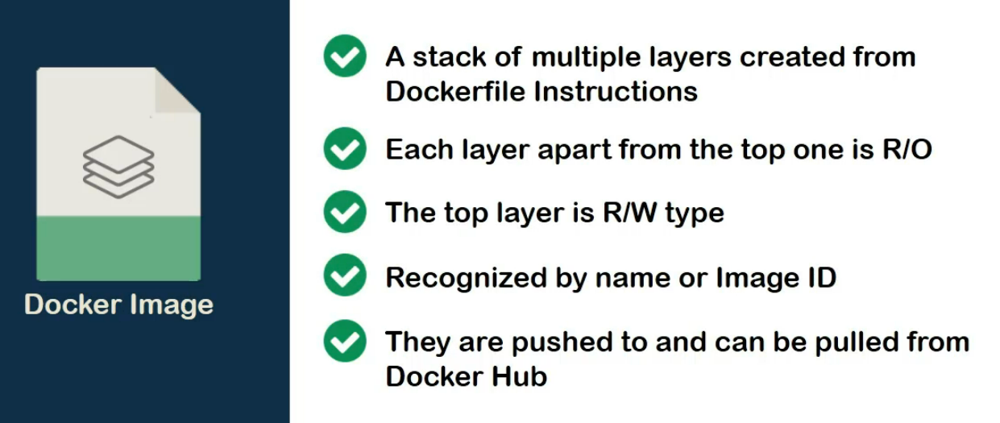
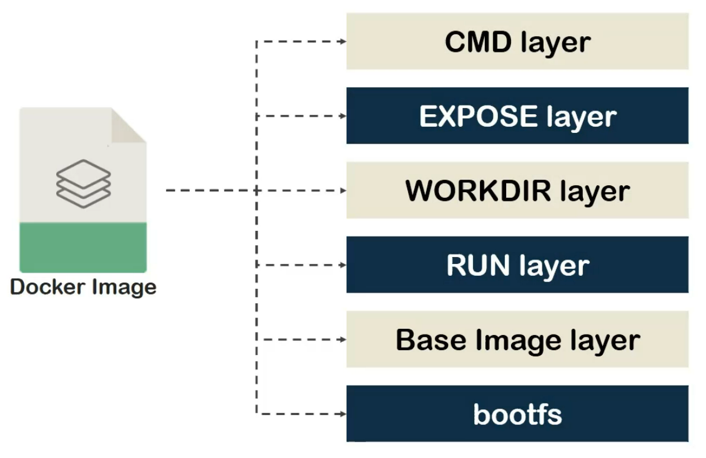

We have already studied and worked with Dockerfile,

It's time to focus on "**docker images**". As we have seen previously, a "docker image" is a **collection or stack of layers** which are created from sequential instructions on a Dockerfile.

The layers are "**Read-Only**". Although that is an exception of the topmost layer which is "**Read-Write**" type but we will get into that later.

The docker images can be recognized either by their "**unique image ID**" which is provided by docker or a convenient name or tag, which is provided by us means users.

Finally, they can be pushed or pulled from Docker Hub which we just visited in the last Demo.

If we want to **visualize the layers of a docker image**, they would stack up **like this**.

We start with the boot file system (**bootfs**) which is pretty much similar to Linux's own boot file system.

It is an arrangement of "cgroup", "namespaces", and "resource allocation" which virtually separates the image from the rest of the files on the host or cloud.

On top of that, we would have base image layer which along with the layers above it will follow the file mapping laid out by boot file system layer.

Next, we have layers such as "work directory", "environmental variables",

"Add", "Copy", "Expose", "CMD" etc..