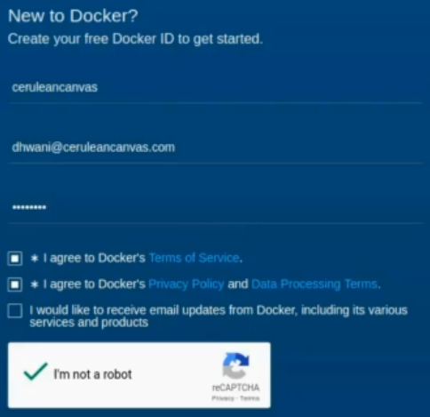
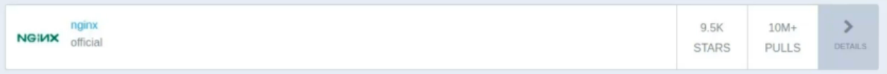

It is about time to go beyond our little host machine and get to know the wide community of Docker.

The best way to do so is to get started with **Docker Hub**. We get back to our web browser. Go to [**hub.docker.com**](hub.docker.com).

And where we land is the **home page** of **Docker hub**. Docker Hub is a **cloud based service** hosted by Docker itself which allows you to build, link, and manage your docker images.

It also provides some of the production-grade useful features like **automated build**.

Just for your information, the auto-builder that we used in our previous section, where we did not provide any name or file while passing the build command, and yet Docker built the content of Dockerfile is also hosted by back-end service of Docker Hub. To access its provision, first, we need to create an account which is totally free and all it needs is a generic set of data like "Username", " Email ID", and a "Password".

Once we have added that, let's agree to the terms and services and prove that we are not robots!

After this step, you should receive an email on the ID that you provided and you should click on the activation link.

I mean that's obvious, right?

Once you have activated your account, you will land on a page which should look similar to this one.

It is called the "**dashboard**".

It displays your username and provides links to almost everything that you might want to do on Docker Hub.

First of all,

We are on the repositories tag where you can explore the globally available repositories or create one by yourself!

You can also create an organization which serves as a unit of repo management above repos themselves.

It is useful if you are not an individual but you are acting for an organization or on behalf of an organization.

And since we have not created any repos yet, we don't have any starred repos or contributions in general.

On the panel about these steps,

we have a few links. First of them, takes you to dashboard where we already are.

So clicking on it will be pretty much pointless.

By clicking on the **Explore option**, we get a whole new world of popular repositories created by individuals and organizations around the world.

To be honest, one of the aspects which makes Docker so popular and loved among the engineers is the enormous contribution by the community, in such a short time! And the fact that Docker acknowledges its importance and provides one place to access it all! These repos are ordered by the number of pulls they have received and our " nginx" which was used in our first ever container of this course, is on the top of the list.

Organization option provides us another link to stuff regarding organizations and "Create" menu provides us a list of options, where we can create either a repo, organization or an automated build. An automated build can be created by providing build context, which is generally a repository containing the Dockerfile named "Dockerfile" on your host machine.

In other words, it is the web version of the short docker build command that we have been using in previous section. Since it is the web version, we have to use a code and version management service like "**[GitHub](https://github.com/)**" or "**BitBucket**".

And finally, we have a list of options for our own profile, where we can do some customizations like adding more information about ourselves, changing passwords, getting some kind of help or most importantly, read documentation! In next videos, we will understand docker images with greater depth and work with them.