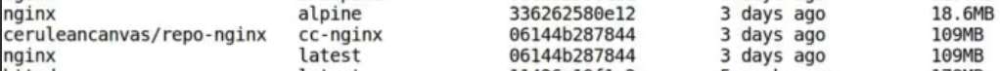
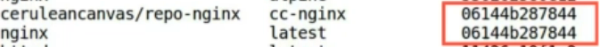

First of all, we have "docker search" command.

It is used to search images from Docker Hub.

```bash
docker search python:3.6
```


> Just to clarify, you don't need to have a Docker Hub account to search the repos from your host or even pulling them. It is just a requirement to use the web interface of Docker Hub or for pushing repositories on it.

As for the syntax of this command, the phrase "*docker search*" is followed by the name of the image, an optional version number after colon.

Let's execute this command.

```
NAME                                   DESCRIPTION                                     STARS     OFFICIAL   AUTOMATED
csig/qci-python3                       official python:3.6-stretch with qci-agent      0                    
eamonwoortman/alpine-python-curl-zip   A python:3.6-alpine image which has curl and…   0                    [OK]
tnir/mysqlclient                       the Python's mysqlclient Docker image (based…   2                    [OK]
mc706/pipenv-3.6                       python:3.6 + pipenv                             0                    [OK]
ramarajumk/python-chromedriver         python:3.6.3 chrome-driver:2.46                 0                    
charact3/python-cassandra-driver       A docker image with python cassandra-driver …   1                    [OK]
shawara/python                         python:3.6-gis  and  python:3.6-slim-gis        0                    
pkrishnaaaaa/python_with_node          lightweight image of node:10.14.0 installed …   0                    
amywoodehy/py-nodejs                   Python:3.6 + Nodejs + Yarn + Postgresql Clie…   0                    
parados/ta-lib-python-3.6              ta-lib:0.4.0 from python:3.6-slim               1                    
iwitaly/nlp                            Based on python:3.6-slim, torch==0.4.1 and f…   3                    
jexx/jexx-deployer                     python:3.6.2 with jq and awscli                 0                    
foobarmus/webapp                       stretch python:3.6 logentries nginx node:8      0                    
yamitzky/localstack-python-alpine      Dockernized localstack on python:3.6-alpine.…   0                    [OK]
staros86/py-i386                       based on python:3.6.4 add i386 library, net-…   0                    
oeeckhoutte/python36-ansible           Very simple image based on python:3.6 with a…   0                    
joecridge1/python36-geo-zip-awscli     python:3.6 image with geospatial libraries, …   0                    [OK]
brendony/python-3.6-paramiko           Python 3.6 and paramiko, based on Python:3.6…   0                    
marcuslau/terraform-awscli             This docker image pulls from the python:3.6 …   1                    
ignatisd/locustio                      A minimal locustio repository on top of pyth…   1                    
iamsre/hass-arm32v7                    home-assistant for arm32v7/python:3.6-stretch   1                    
valentinvoigt/docker-python-npm        python:3.6 with nodejs and npm packages         0                    [OK]
gladiatr72/python                      refactor of python:3.6-slim image               0                    
aeoluswing/flask                       A simple flask docker image for python:3.6.5…   1                    [OK]
andyxu9529/scrapy_docker               scrapy images in python:3.6.1-alpine3.6         0                    [OK]
```

Here, we get a **list of Python images**, sorted by the **number of stars**.

Of course, many of them are **frameworks built on top of Python**, since Python would be one of the **keywords**.

There are description of images to provide more brief insight and a check of whether the image is official or not.

Here, the first image has the most stars and it is also the official image.

Next, we have quite a special case. "docker search registry" command gives **official image** of docker registry from Docker Hub.

```bash
docker search registry
```
If we don't want to get such a long list of repositories, we can also put filters on our search. Here, we have put filter `is-offical=true` which will only show us official images. There we go!

```bash
docker search --filter "is-official=true" registry
```
```
NAME       DESCRIPTION                                     STARS     OFFICIAL   AUTOMATED
registry   Distribution implementation for storing and …   3959      [OK]  
```
We only got one image.

Sweet, right?

For those who like their results neat and tidy, Docker also lets you format the results of the search. Here, the format is mentioned in double inverted commas and it starts with the keyword `table` which means we want a **tabular format**.

Then, we have entered the desired fields that we want.

The fields are mentioned in double curly braces and they're separated by `\t` which stands for **TAB** or **SPACE** character.

```bash
docker search --format "table {{.Name}}\t{{.Description}}\t{{.IsOfficial}}" registry
```

You might have guessed by now that this will create **three columns** one of each field.

Now that the predictions and wish lists are done, let's run the command.

There, we go! Our crowded little table is here and it is showing the same repositories as before just in visually different format.

Also noticed that we only have three fields that we had mentioned in the command and rest of the fields are skipped. Moving on from docker search, we have docker images command.

```bash
docker image ls
```

It is a shorter version of "docker images ls" command, and both of them do exactly the same thing which is list out the images on your host!

As you can see, these are the images that we built during our previous section.

```
REPOSITORY    TAG       IMAGE ID       CREATED        SIZE
img_apache    latest    0b578aa2d8c2   23 hours ago   234MB
img_expose    latest    bb2475302bb4   24 hours ago   191MB
img_run-env   latest    209d96c57387   2 days ago     151MB
img_from      latest    663569db8d63   2 days ago     162MB
nginx         latest    a8758716bb6a   3 months ago   187MB
hello-world   latest    d2c94e258dcb   9 months ago   13.3kB
```
On the other hand, if we want to list out versions or instances of particular type of image, we can mention the image name followed by docker images command. let's try and list all over Ubuntu images.

```bash
docker images ubuntu
```

Here, we can also see the size of the image which denotes the size they currently occupy on the storage of host machine.

Of course, specifying the version number preceded by a colon narrows down the list just to one entry!

```bash
docker images ubuntu:16.04
```
Furthermore, if we want to see the full parts of truncated data like image ID, we can use `--no-trunc` flag as well, but be cautious while using it since it can make the results messy.

```bash
docker images --no-trunc ubuntu:16.04
```
Really messy!

Then, we have docker pull.

It pulls the specified image from Docker Hub to our docket host.

```bash
docker image pull nginx:latest
```

Here, we have provided `nginx` with colon `latest` tag.

So, whichever image will have the latest tag on Docker Hub's nginx repository will be pulled. As you can see, it has downloaded a newer version of nginx which is latest.

Instead of latest, if we use `nginx:alpine` , Docker Hub will provide an image with **alpine tag**.

```bash
docker image pull nginx:alpine
```

Now, if we grab a list of available nginx images on our host, we get two of them.

**First**, is the **Alpine one** which we just pulled and second, is the latest version. As you can see, both of them vary majorly in terms of size.

> **Alpine** is like minimal nginx image which is smaller in terms of size since Alpine as the base OS itself is smaller.

Finally, if we want all variants of nginx images, say for testing purpose, we can hit the command with `--all-tags` flag and we will receive the missing images from the repository.

```bash
docker image pull --all-tags nginx
```

Once we list the nginx images now, it is clearly visible that these are different versions with different sizes.

We are back to our **Docker Hub dashboard**.

Let's click on **"Create Repository" option** so we can make a repo and push images to it. On the left pane, Docker is generous enough to list out the steps to create a repo.

First of all, we are supposed to provide a namespace our repositories so that we don't how to make the name unique across the globe.

Generally, namespace is same as the user name.

Now, let's name our repository. We are naming it "repo-nginx". You can name it anything you like!

Next step is the description of this repo. Here, as you can see, we have given a short and sweet description about this repo. if you want to describe your repo in much more detail, you can jump to the full description section of this repo and in the final step, we can set the visibility permission for our repository. Docker offers one free private repo and unlimited public repo with free Docker Hub account.

So, do your choices wisely!

We don't need private repos for now, so we will select the public visibility for this repo.

Now, let's create the repo by pressing create button at the end of the page.

We have successfully created our repo nginx. As we can see that there are some tabs above the short description of the repo.

First one is the "Repo Info" tab. It displays the basic information about our repo-nginx such as its visibility- which is public, and short description about it.

Second one is Tags.

You can add multiple images under a single repo, separated by different tags.

If you do not specify any tag for the image, it will by default take latest tag.

Third one is "collaborators".

It consists of a user or a list of user whom the owner of the private repo wants to grant the read, write or admin access. Next, and the fourth one is "Webhooks". webhook is the HTTP callback post request.

It can be used to notify user, services or other applications about the newly pushed image to the repo

Last one is the "Settings" of the repo.

User can change the visibility permission of the repo and can also delete the repo from user's Docker Hub account permanently.

Now as you can see, you can pull the images available under the "repo-nginx" repository by using this specific docker pull command

`docker pull ceruleancanvas/repo-nginx` and store them on your machines.

Since this is your first ever depositary created on Docker Hub, let's self-indulge ourselves by giving it a star!

Staring a repo is a way to show that you like the depositary and you can remember it for your future references.

Now let's switch back to the terminal. Before pushing an image to docker registry, we need to log in again to docker hub using docker login command interactively.

```bash
docker login
```

Here, we have been asked to enter our docker hub login credentials. We will enter our username which is ceruleancanvas and it's password.

We have successfully logged in our account with a warning which says that our docker hub password is stored unencrypted in config.json file on our machine for future references.

We are OK with it for now.

So we will ignore the warning and proceed to the next step.

Now, we will tag a local image nginx:latest into a new image.

```bash
docker tag nginx:latest ceruleancanvas/repo-nginx:cc-nginx
```

We will specify where we want to push this image.

We can write the host name on which the registry is hosting which is `ceruleancanvas` for us.

Now, we mentioned the registry name in which we want to push the image that is `repo-nginx`.

You want to give your **own custom tag** to the image such as `cc-nginx` for this example.

Or if you don't mention any tag for the image, it will take latest by default.

This two-stage format is mandatory to push an image to a public repository.

Now, let's check out our newly tagged image by listing all images on our machine.

```bash
docker images
```

There you are!



We have original `nginx:latest` image and newly tagged `ceruleancanvas/repo-nginx`calling `cc-nginx` image.

But, did you notice something? These two images have the same image ID!



It is because docker tag command has created an alias for your image as its new image name. So that, the original image will be untouched and all of its changes can be performed to the new aliased image.

Now, let's push ceruleancanvas/repo-nginx:cc-nginx to our repo-nginx using `docker push` command.

```bash
docker image push ceruleancanvas/repo-nginx:cc-nginx
```

We have already specified the path for the destination location in image name. As we can see, Docker is pushing each layer of the original latest image at this end. On the other hand,docker daemon will stack all of these layers sequentially and create a new image with the tag cc-nginx in the repo-nginx.

At the end of the process, we got our new image digest identifier of the push image.

Now, let's switch back to Docker Hub account, to verify that our report has been successfully pushed. We wil navigate to the repo-nginx repository, go tags, and we have successfully pushed the image. Image tag, size, and updated name are mentioned here. In next lecture, we will dig deeper into the image by inspecting it and looking at its history.