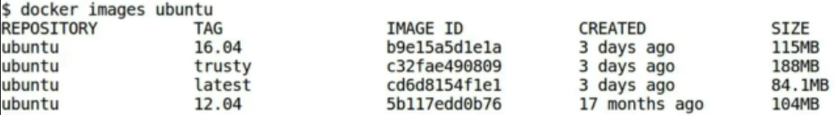
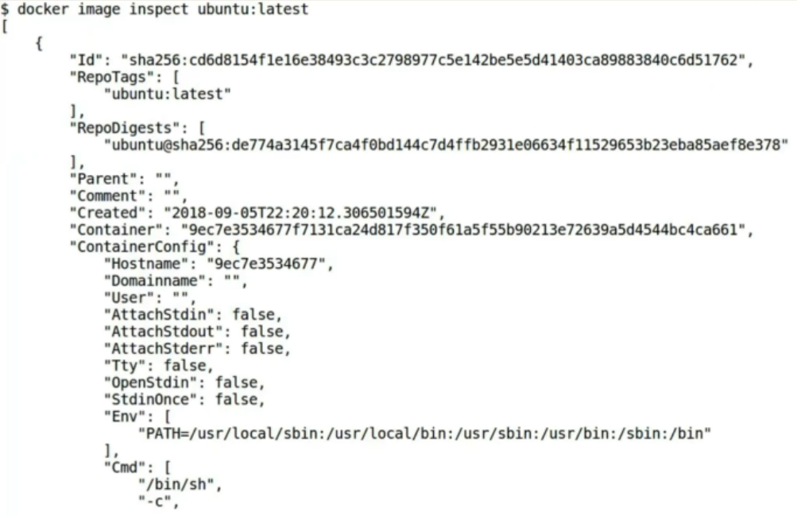

As we know, that docker images command will list out all of the docker images stored in our machine with some basic information such as Image ID, repository name, and image tag to identify different images.

But, what if we want to know more about any particular image?

Well, for that we have docker inspect command. docker inspect command returns information about every single docker object, who has contributed in the creation of a particular docker image which can be very useful at the time of debugging.

Let's list out all of the ubuntu images available on our local machine by writing command docker images ubuntu.

```bash
docker images ubuntu
```

There we are!



We have **four ubuntu images** with **different image tags** under ubuntu repository.

Let's inspect `ubuntu:latest` docker image. Type `docker image inspect` command followed by the image name that you want to inspect.

```bash
docker image inspect ubuntu:latest
```

We will type `ubuntu:latest` here. Press enter and as you can see, it has displayed the detail information about the latest ubuntu image in **JSON array**.

```

```


Here, we can see the extended image **Id** of `ubuntu:latest` followed by **Repo name** and **RepoDigests** which is the **64 digit hex number**.

Next, we have container identifier.

Don't confuse it with the container Running ubuntu image.

It is the intermediate container, which docker has created while building the ubuntu image from Dockerfile.

ContainerConfig is the configuration details about the same intermediate container which is stored as image's metadata for reference.

Next, is the information related to scratch image and its architecture, which is used as the base image here.

It also mentions the actual and virtual size of the final image. And at last, we have `RootFS` identifier which shows digest of all intermediate layers of this image.

If you want to access a specific detail about an image, you can format the output of docker inspect command.

```bash
docker image inspect --format "{{.RepoTags}} : {{.RepoDigests}}" ubuntu:latest
```

Type docker inspect followed by the format tag, provide arguments to format flag between inverted commas.

`RepoTags` and `Repodigests` separated by colon.

Type docker image name. Press enter and as a result, we got that `RepoTags` and `RepoDigest` of `ubuntu:latest`.

We can also save the inspect results of an image to a file in JSON format for future references.

```bash
docker image inspect --format "{{json .Config}}" ubuntu > inspect_repoet_ubunutu.json
```
Here, we want to store the configuration details about this image in a text file. To do so, type docker image inspect format followed by `{{json .Config}}` ubuntu and store the result in inspect_report_ubuntu.txt file. It is just a name that we have given to the file.

You can do any name which you want! List out all of the available files, inspect_report_ubuntu has been successfully created.

Let's check out the contents of this file.

Config details about the latest image is available in the text file.

If you remember, `RootFS` identifier in the inspection of `ubuntu:latest` image showed only the digest of all intermediate layers in the image, based on only digests.

It is difficult to determine how the image was built. For that, We have `docker history` command. `docker history` will show us all the intermediate layers of an image.

```bash
docker image history img_expose
```
```
IMAGE          CREATED        CREATED BY                                      SIZE      COMMENT
bb2475302bb4   43 hours ago   CMD ["nginx" "-g" "daemon off;"]                0B        buildkit.dockerfile.v0
<missing>      43 hours ago   EXPOSE map[80/tcp:{}]                           0B        buildkit.dockerfile.v0
<missing>      43 hours ago   RUN /bin/sh -c apt-get update && apt-get ins…   56.6MB    buildkit.dockerfile.v0
<missing>      2 years ago    /bin/sh -c #(nop)  CMD ["/bin/bash"]            0B        
<missing>      2 years ago    /bin/sh -c mkdir -p /run/systemd && echo 'do…   7B        
<missing>      2 years ago    /bin/sh -c rm -rf /var/lib/apt/lists/*          0B        
<missing>      2 years ago    /bin/sh -c set -xe   && echo '#!/bin/sh' > /…   745B      
<missing>      2 years ago    /bin/sh -c #(nop) ADD file:11b425d4c08e81a3e…   135MB   
```
Let's find out the intermediate layers of this image. Type docker image history ubuntu In terminal. We got all the intermediate layers for our latest Ubuntu image.

These layers are stacked sequentially, starting from the base image at the bottom to the CMD layer at the top of the results.

All the layers have that associated image IDs, sizes, and their creation time. To dig deeper into this, Let us find history of one of the images which we have built on our local docker host. We will find history of img_apache. Now, type docker image history followed by the image name which is img_apache and press enter.

```bash
docker image history img_apache
```
```
IMAGE          CREATED        CREATED BY                                      SIZE      COMMENT
0b578aa2d8c2   43 hours ago   CMD ["/usr/sbin/apache2" "-D" "FOREGROUND"]     0B        buildkit.dockerfile.v0
<missing>      43 hours ago   EXPOSE map[80/tcp:{}]                           0B        buildkit.dockerfile.v0
<missing>      43 hours ago   ENV APACHE_LOG_DIR=/var/log/apache2             0B        buildkit.dockerfile.v0
<missing>      43 hours ago   ENV APACHE_RUN_GROUP=www-data                   0B        buildkit.dockerfile.v0
<missing>      43 hours ago   ENV APACHE_RUN_USER=www-data                    0B        buildkit.dockerfile.v0
<missing>      43 hours ago   RUN /bin/sh -c apt-get update && apt-get ins…   98.9MB    buildkit.dockerfile.v0
<missing>      43 hours ago   LABEL Creator:=Cerulean Canvas                  0B        buildkit.dockerfile.v0
<missing>      2 years ago    /bin/sh -c #(nop)  CMD ["/bin/bash"]            0B        
<missing>      2 years ago    /bin/sh -c mkdir -p /run/systemd && echo 'do…   7B        
<missing>      2 years ago    /bin/sh -c rm -rf /var/lib/apt/lists/*          0B        
<missing>      2 years ago    /bin/sh -c set -xe   && echo '#!/bin/sh' > /…   745B      
<missing>      2 years ago    /bin/sh -c #(nop) ADD file:11b425d4c08e81a3e…   135MB
```

You might be wondering, why some of the rows of image column in both the results contain **<missing>** and some of them have their **image IDs**.

As you may remember, the intermediate image IDs are given to the layers created by dockerfile instructions and they can be used for caching purposes by our own docker host. But, if an image is pulled from Docker Hub, such caching would not happen. And since it may cause environmental clashes. So, we are not provided any image IDs for intermediate layers of pulled images.

All we can know, is they exist.

We have two types of intermediate images, which are easy to distinguish.

1. One, which are **built by some other docker** host and we have just used it as base image,
2. And the ones, which are **committed by our instructions**. You can also identify them by the time they were committed. The base image intermediate layers are 17 months old.

Whereas the other ones are committed just a few hours ago.