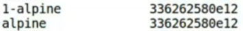
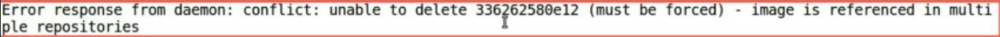

Having unnecessary images lying around our host can be quite a bother.

Firstly, it consumes a lot of disk space and having multiple version of similar images can cause confusion nonetheless. Let's list out our available images.

```bash
docker images
```
```
REPOSITORY    TAG       IMAGE ID       CREATED        SIZE
img_apache    latest    0b578aa2d8c2   43 hours ago   234MB
img_expose    latest    bb2475302bb4   43 hours ago   191MB
img_run-env   latest    209d96c57387   3 days ago     151MB
img_from      latest    663569db8d63   3 days ago     162MB
nginx         latest    a8758716bb6a   3 months ago   187MB
hello-world   latest    d2c94e258dcb   9 months ago   13.3kB
```

Just take a look.

The list is already exhaustive.

Time to narrow it down a bit to keep things neat and tidy.

First let's use rm or remove command.

```bash
docker image rm img_apache:latest
```
```
Untagged: img_apache:latest
Deleted: sha256:0b578aa2d8c2a5805ec761e2b842db25a8d235b08c0d85f90626385d2c2ce6ef
```


We will remove an image with 1-alpine-perl tag. As you may remember, these images were pulled as a stack of leared intermediate images so they will also be removed similarly.

All of the intermediate images along with the resultant image, will be removed from our host.

Just to verify how did our command do?

Let's get another list of images and we shouldn't find any image with 1-alpine-perl tag.

Another way to write image rm is to simply write "rmi" and follow it by Image ID.

```bash
docker image rmi 0b578aa2d8c2
```
When we use image ID instead of image tag, all images containing that ID will be removed.

Here, `1-alpine` and `alpine` variants of `nginx` image will be affected by this command.

```bash
docker image rmi 336262580e12
```




On the other hand, such an operation involving ID of the image which is used more than once cannot be performed normally.

That's why, we are getting this error.



And the suggestion to remove them **forcefully**.

Let's do so. We will use the same command with `force` tag.

```bash
docker image rmi 336262580e12 --force
```

As you may notice, all of the images with this ID will be freed from their tag and they will be removed along with their intermediate images.