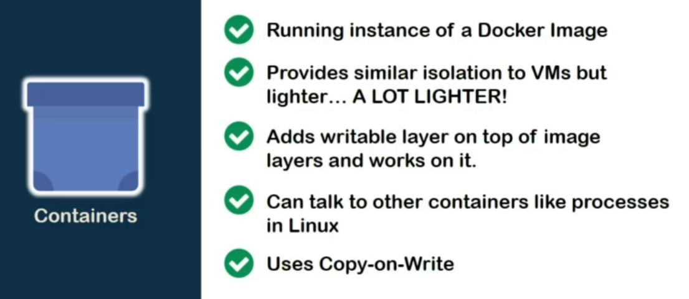

We are done with both Dockerfile and docker images.

So now, it is time to pay our much needed attention to the center point of this course, **CONTAINERS!**

We have already seen the formal definition of containers.

But, if we consider our updated knowledge, the simplest way to describe a container would be "*a running instance of a docker image.*"

You can compare it to the analogy of process and program in Linux. just like a process is a running instance of a program, a container is a running instance of an image.

With help of namespaces under Linux host, containers provide similar solutions **like VM**.

Each container has its own file system, network driver, storage driver, and administrative privileges as well! Despite of all of these,

any container would be at least a hundred times lighter than the VMs hosting the same set of softwares.

We have seen previously that docker images are made of **read-only layers** and that **top** most layer is **writable**.

Well, this top layer is provided to it while creating a container out of the image. With correct network configurations,

containers can also talk to each other via **IPs** or **DNS**.

It also follows Copy-on-Write policy to maintain the integrity of the docker image, which we will explore soon.

You may wonder, what exactly do we mean by **running the image** ?

Well, much less to the surprise, Run can be defined pretty simply in our context.

It means providing resources like **compute**, **memory**, and **storage**.

