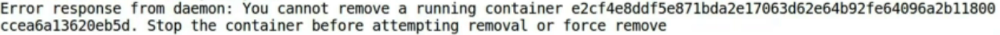

So, in this demo, we will learn different ways of removing the containers.

Let's list out all of our containers and yes, there are quite a lot of them!

In fact, many of them are not that significant at the moment and should be removed!

```bash
docker container rm cont_from
```

First, we have the basic `rm` command followed by a container's name. Here, we have preferred a stopped container `cont_from`. Once it is removed, it will disappear from the list.

Then, we have the same `rm` command, but instead of providing name, we have provided the container IDs of the stopped containers and the result is the same. They disappear from the list after being removed.

```bash
docker container rm 095e28c7829a bf877f3ab875 0684e722b0ab
```

The case will be a bit different with the running containers. Just to make sure that we are not making any mistakes while deleting a running container, it asks us to provide the force deletion flag.



I would say, it is a kind gesture since it avoids potential unforced errors. As we add the `force` flag, nothing can stop us from removing it!

```bash
docker container rm cont_from --force
```

If we want to be kind to containers and want to kill them properly, we can send the **SIGTERM** signal using `docker container kill` command.

```bash
docker container kill --signal=SIGTERM cont_nginx
```

But as you can see, we still have quite a few containers running and we don't need the stopped ones for the most part. To remove the stop containers, we have command called `docker container prune`.

```bash
docker container prune
```

It is a short and sweet command and doesn't require any names or IDs.

It will simply **kill all of the dangling containers** and free up whatever resources it can.

We had three of such containers which got removed and we got 1.185 megabytes of free space.

Finally, our list of containers only contain the live ones.