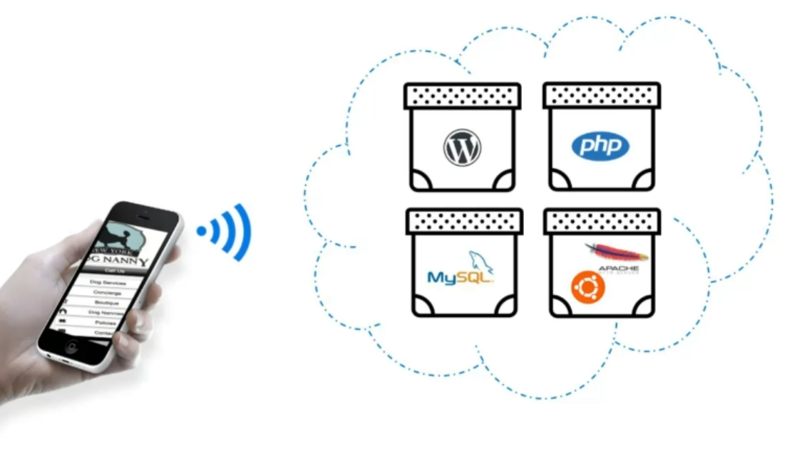
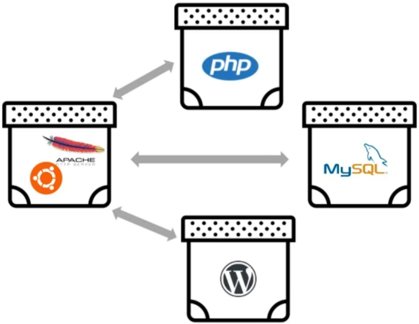
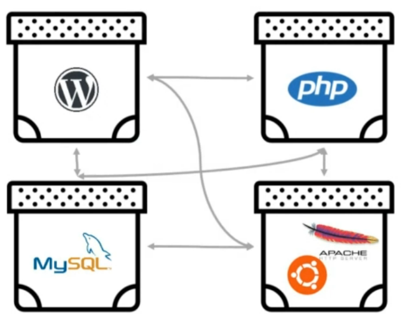
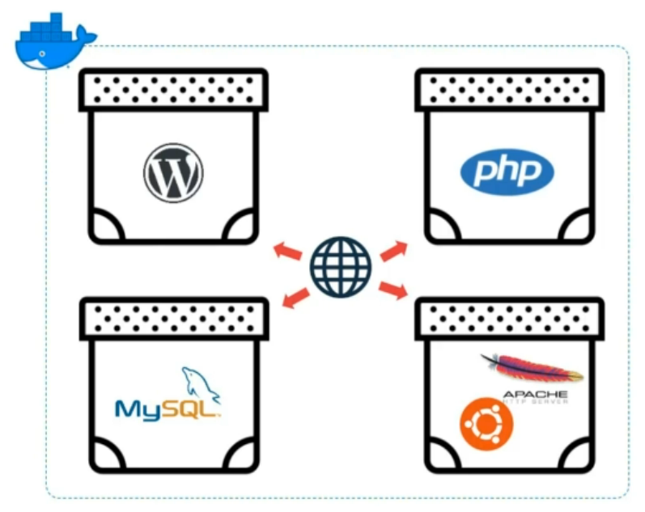
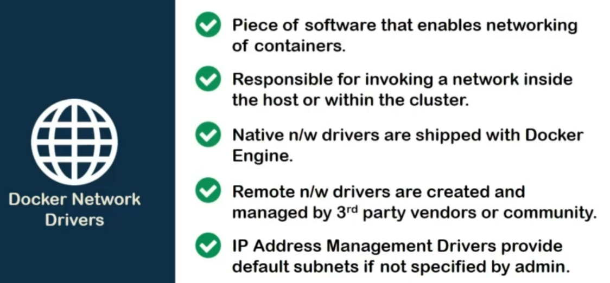

Till now, we have played with single container scenarios.

Even if we did use more than one containers, they were completely independent of each other.

For example, one container might be enough to host a static landing page but a **smartphone app** would definitely require **more than one containers**, where each of them may serve specific purpose. In such a case, information exchange between containers become a crucial factor of overall performance of the application.

In other words, they need to talk! The communication can be **one to one**.

**One too many**.

**Or many to many**.

In case of docker containers, these communications are managed by objects called **network drivers**.

To define them simply, a docker network driver is a **piece of software** which handles container networking.

They can be created simply using **`docker network` command**. No images or files are required.

Speaking of networks, these networks can span from single host instances to multi-host clusters.

For now, we'll focus on single host and we will visit cluster networking when we deal with docker swarm.

Docker network drivers are quite reliable since docker itself uses them to communicate with other containers and outside world.

This also means that *docker* itself **provides** some **native network drivers**, if we don't want to bother creating ones by ourselves. As a tradeoff, it means less control over IP ranges and ports.

Apart from the networks we create and the default ones, docker also supports **remote network drivers** which are developed by **third party** and can be installed as plugins. Although they are still quite under growing stage and mostly they are useful for specific use cases like enabling networking on a certain cloud provider.

Apart from network drivers, docker also provides **IPAM** or **IP Address Management** driver which handles IP address ranges and distributions, if they are not specified by the admin.

I know, you have loads of questions like :
- How do these networks work?
- Are there any types?
- Is there any structure which they follow?

