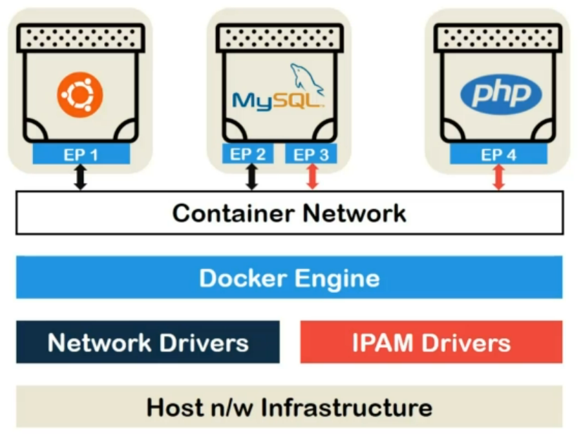

Let's dig deep into container networking model. First of all, we have host **network infrastructure**.

This includes both software and hardware infrastructure details like using ethernet or Wi-Fi, and host OS kernel network stack. In our case, Linux network stack. On top of that, we have docker networking drivers which include **Network** and **IPAM drivers**.

We just recently stated their functionality briefly in last lecture. On top of these drivers, we have **docker engine** which creates individual network objects.

As you might have guessed, user-defined or default **container network** objects fall on top of docker engine since there are provision by it. These blocks are a part of docker itself.

On top of our container network, we have running containers which are accompanied by at least one end point.

I said at least one because it is normal for a container to have connected it to two or more networks and hence consisting of more than one end-points.

Speaking of end-points, they are container side connector representation of virtual ethernet which is the common protocol for networking across docker. They contain networking information such as IP address, virtual physical address, and ports.

As mentioned earlier, if a container is connected to more than one networks it will have more than one corresponding endpoints which will contain different IPs.

The scope of these IPs would typically be limited to the host in case of single host implementation.

Within the same scope, if **two containers** are connected to the **same network**, they can also communicate via **DNS** where container names and be used instead of IPs.

Container networks provides this information to network and **IPAM drivers**. Then, network and IPAM drivers translate this requests into host network supported packets and transmit them to make sure containers can communicate to the outside world.

Because if that doesn't happen, forget nginx, you wouldn't even be able to execute `apt-get update` command properly.

So, this is how container network model works.