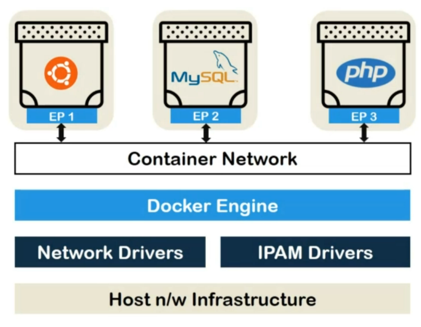
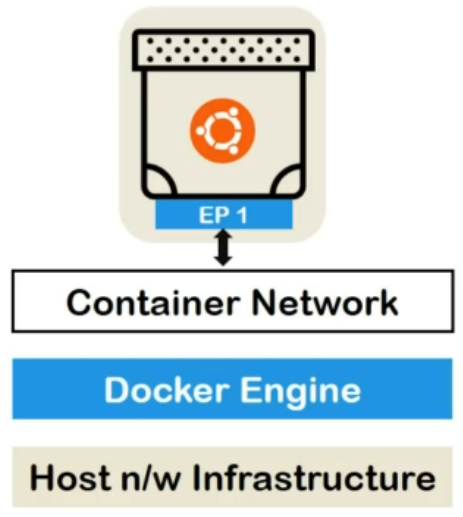
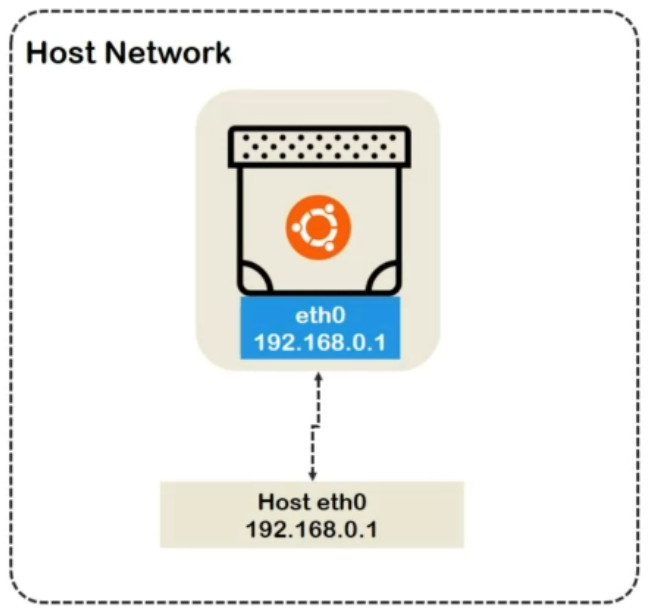
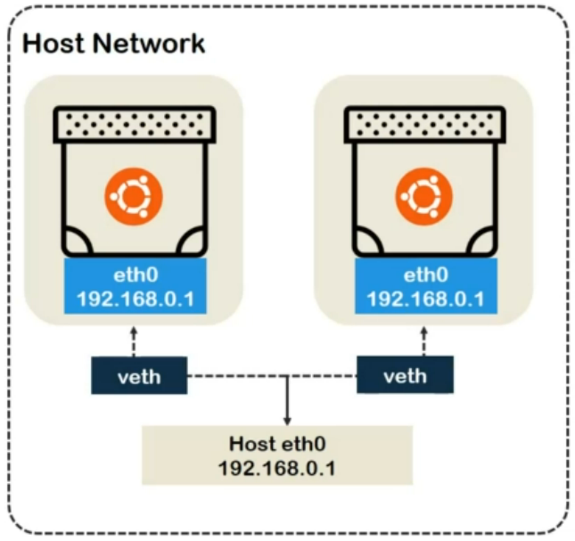
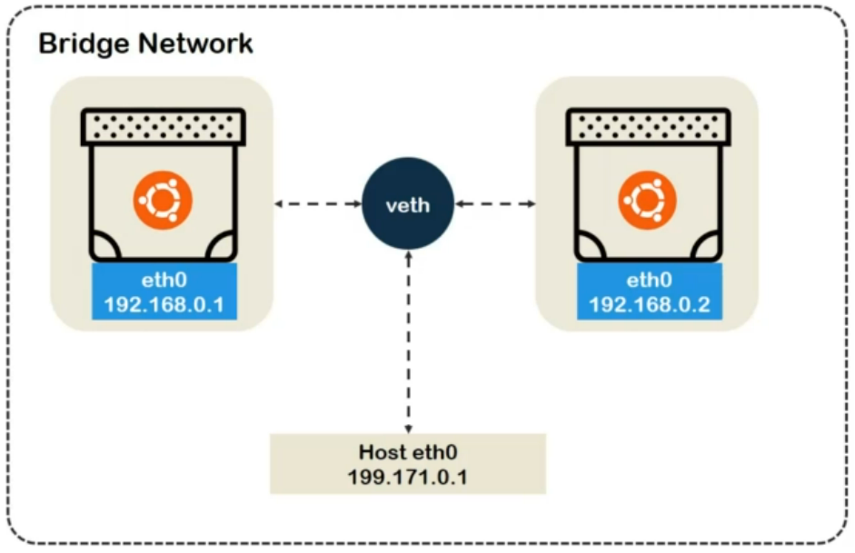
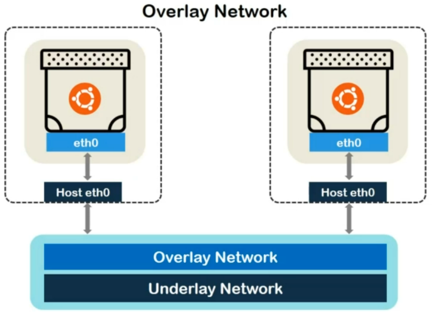
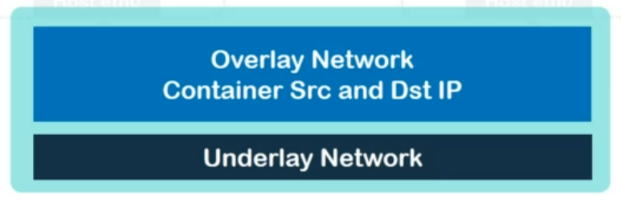

Out of native and remote network drivers,

we are going to work on native drivers. **"Native docker network drivers"** are used in creation of default or user-defined networks.

Do remember this diagram from previous lecture?

Let's shrink it a bit for the convenience.

## Host Network

Now, let's consider the first type of network. The **"host network"**.

The idea is pretty vanilla here.

Network credentials of the host are directly reflected on the container endpoint, which means containers connected to this network will have the same IP as the host itself. This doesn't mean that container will abandon their true nature though.

Getting a bit more practical, let's say we have **two containers connected** to the default or user-defined host network.

In this case, both containers will communicate via **virtual ethernet** reflecting the capabilities and limitations of the host machine.

## Bridge Network

Moving on from host, we have **"bridge network"**.

It is also the "default" network for docker containers.

If we don't explicitly connect our containers to any network, they will be connected to the default bridge network.

The name of this network helps a lot in defining its properties.

It creates a virtual ethernet bridge. All of the containers connected to this network are connected to this bridge via container endpoints. The bridge communicates to the host network,

it means that the **containers will be isolated from host network** specifications.

Containers will have different IPs then host.

We can define the IP range and subnet mask for the bridge and subsequent networks but if we choose to opt out from this decision, IPAM drivers manage this task for us.

We can ping or address these containers using the IPs provided by the virtual bridge.

Of course! The communication will pass through the host machine's network means if it is down, bridge won't be able to do much about it.

But this can help us hiding the DNS or IP of the host.

**In the recent version of docker (i.e. 17 and above)**, we can also use container names to address them when we are communicating within the same docker bridge network. We will practically explore these networks more in demo lectures.

## Overlay Network

Further, we have **"overlay network"**. In case of overlay network, we do need to come out of the cocoon of single host docker infrastructure. In industrial usage of Docker Community or Enterprise Edition, you will most likely find cluster or clusters of docker host, which will run single, connected or at least relevant set of containerized applications. Such an arrangement is called **"swarm mode"** in docker. Swarm heavily relies on overlay network provisioning of docker.

We are yet to cover swarm in our course, but do not worry, this explanation will not flood you with unknown swarm terminologies.

In case of bridge network, all we had to worry about was container's IP since we had only one host.

But with overlay network, we will have multiple host having multiple containers where any combination of communication might be necessary.

So, while establishing or performing container to container communication, our network driver can't get away by just keeping track of container's IP.

It also needs to route its communication to the proper host. To solve this, overlay network will have two layers of information.

**"Underlay Network"** information. which will contain data regarding **source and destination of host's IP**.

And **"Overlay information layer"** which will contain data about **source and destination container's IP**.

As a result, the communication packet header will consist of IP addresses of both source and destination host's and container's. We will look into it practically, when we introduce swarm.