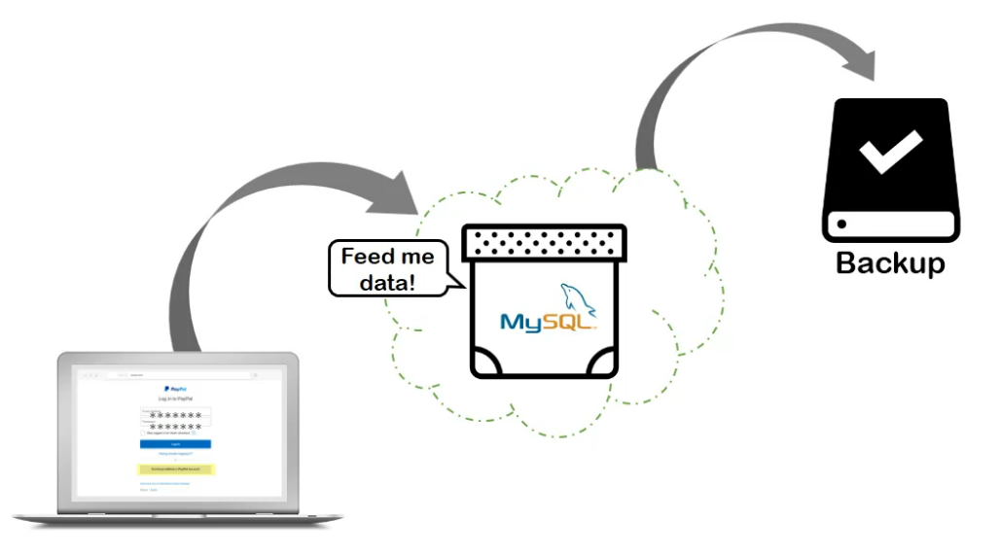
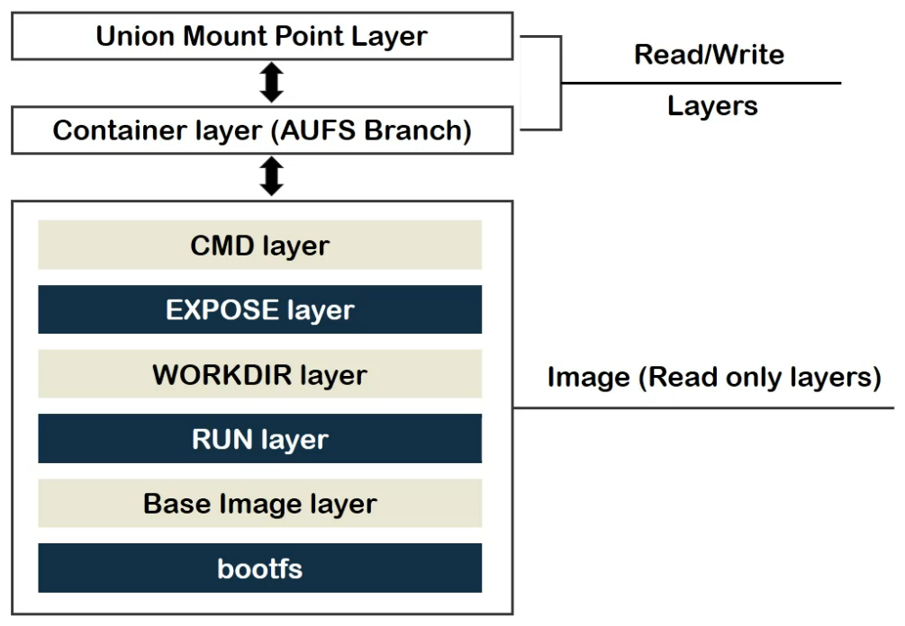
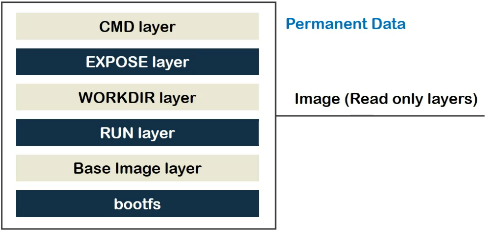
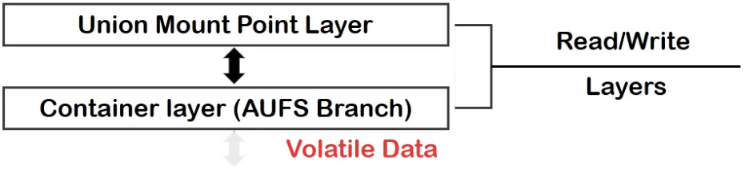
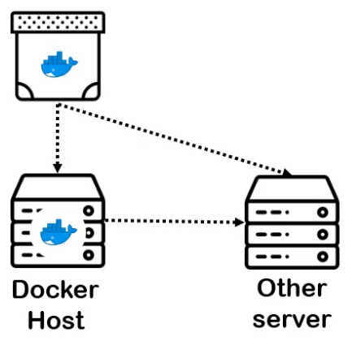
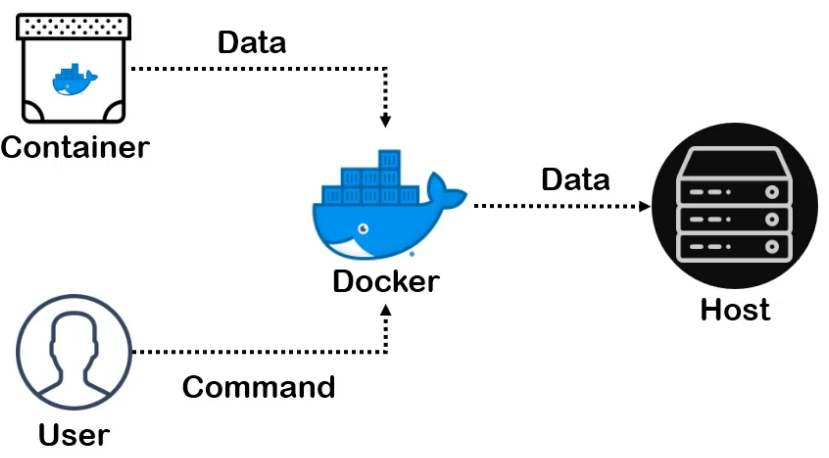
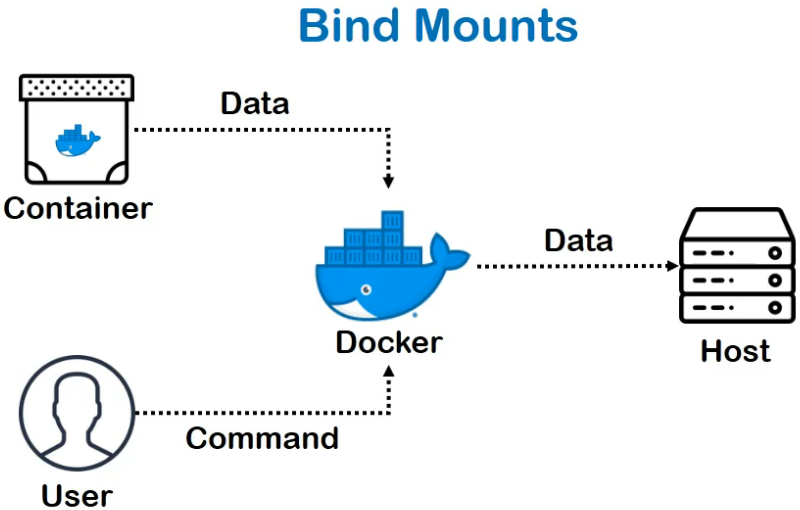
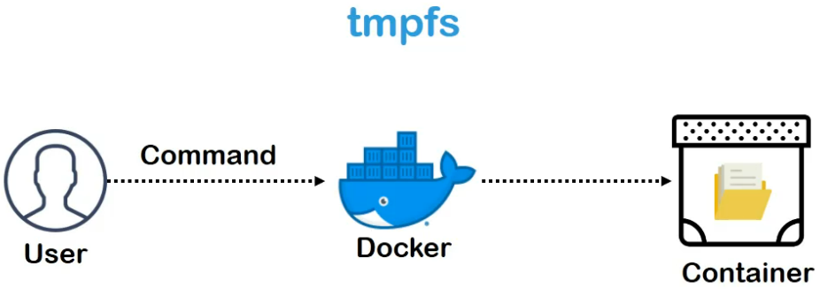

From a third person's point of view, this may seem like a funny story but it can potentially cost you your job!

That's the prime reason why we need efficient store solutions with containers.

The logic is pretty simple. Containers data needs to be backed up somewhere as a permanent storage and a quick question that would come up in your mind would be, what or which the data should be backed up? To answer that, we need to look back at the layered structure of docker image and container data.

If you remember, we have two types of layers:
- "**read only layer**", which hold permanent data and is never modified due to Copy-on-Write policy.

- "**read-write layers**" which hold temporary or volatile data.

> If a container stops or dies, the volatile data vanishes.

**So now, we have our answer!**

We need to **back up the important data** from the volatile read-write layer of the container.

Now, the next question is: **where to store the data?**

Well, Just Anywhere! Do you want to store it on some machine which hosts docker?

Go ahead!

Do you want to store it to another server?

Go ahead!

Do you want to store it on Cloud?

Go ahead, as well!

And the last and genuine question which comes to my mind is, are there any type of storage objects?

Yes, there are.

Most commonly used storage object type is called a docker volume. In a volume, a container storage is completely isolated from the host file system. Although the data of volume is sorted in a specific directory of the host,

They are controlled and managed by docker command line. Compared to other options of storage, which we will visit soon enough, volumes are more secure to ship and more reliable to operate.

## Volumes

**Volumes** are storage objects of docker which are mounted to containers. In terms of implementation, volumes are dedicated directories on host's file system.

If a containerized app is shipped along with the volume, people apart from the developer himself using the app will end up creating such a directory on their own docker hosts.

Container provides data to docker engine and user provides commands to store the data in the volume or to manage the data in the same. Although, what container knows is just the name of the volume, not the path on the host.

The translation takes place on docker machines and so **external applications having access to containers will have no means to access volumes directly**.

This isolation maintains the integrity and security of hosts and containers.

## Bind Mounts

Second option is **bind mounts**. The exchange of information is pretty similar, apart from the fact that...

Instead of creating a directory inspired by the name of volume, bind-mounts allow us to use any directory on docker host to store the data.

While this might be convenient in some cases, it also exposes the storage location of the container, which can make dents on the overall **security** of the application or the host itself.

Apart from that, the other users apart from the developer himself, may not have such part on the host and creating so may not be under their privileges or comfort.

Finally, we have **"tmpfs"** or **temporary file system**. **Volumes** and **bind-mount** let you **share the files between host machine and container** so that you can **persist** the data even after the **container is stopped**.

## tmpfs

If you're running **docker on Linux**, you have a third option. **"tmpfs mounts"**. When you create a container with tmpfs mount, **the container can create files outside the container's writable layer**.

As opposed to volumes and bind mounts, a tmpfs mount, is temporary and **only persists in the host's memory, not in storage**. When the container stops, the tmpfs mount is removed and the files written there won't be persisted.

The only sensible use case is which comes to my mind for tmpfs is to **store sensitive files** which you don't want to persist, once the application gets deleted. Something like the browsing history which gets deleted if you use the "incognito" tab.

**tmpfs mounts** have their limitations. They can be created not shipped, and they won't work on non-Linux environments like Docker on Windows.