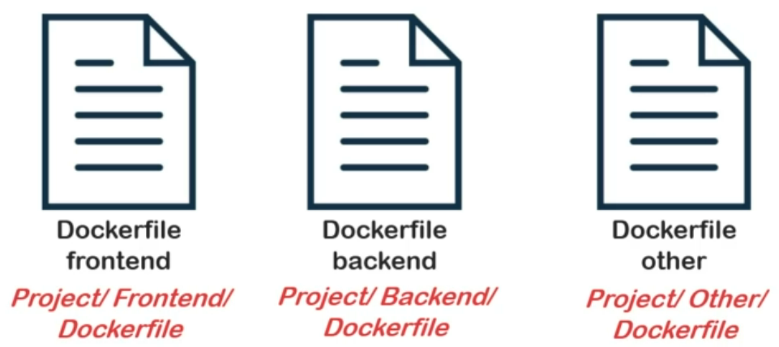
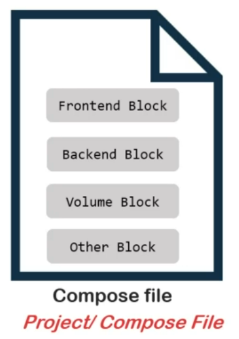

Till now, we have been studying the objects of Docker Engine, but as we had mentioned earlier, Docker Ecosystem has more than one major components. Another such is **"Docker Compose"**.

**Compose** is a tool for defining and running complex applications with docker. In case of working simply with docker engine, we need multiple Dockerfiles for multiple parts or containers of a full-fledged application.

For example, we may have to create **separate files** for front-end, back-end, and other containerized blocks which can be daunting to manage!

With compose, you can define a **multi-container application in a single file!**

Then, spin up your application in a SINGLE COMMAND, which does everything that needs to be done to get the app running.

You can define and integrate multiple Docker objects such as containers, networks, services, etc. in a single file as blocks and compose will translate them to Docker engine for you!