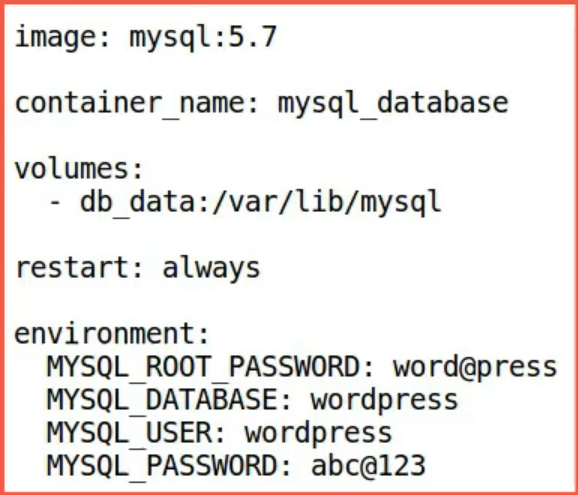

To work with compose files just like 2nd module, we are again shifting back to commands and files together.

Now, just to make sure, let's see what is our present working directory.

And as you can see it is **CC_Docker**.

Just to remind you again, CC_Docker has 8 directories in total,

Each one of them stands for a separate module.

Currently, we are working on a S6 directory so let's navigate there.

```bash
cd CC_Docker/S6
```

And as you can see, there is a file called `docker-compose.yaml`.We will opened this file.

```yaml
version: '3.3'
services:
   db:
     image: mysql:5.7
     container_name: mysql_database
     volumes:
       - db_data:/var/lib/mysql
     restart: always
     environment:
       MYSQL_ROOT_PASSWORD: word@press
       MYSQL_DATABASE: wordpress
       MYSQL_USER: wordpress
       MYSQL_PASSWORD: abc@123

   wordpress:   
     depends_on:
       - db
     image: wordpress:latest
     container_name: wd_frontend
     volumes:
       - wordpress_files:/var/www/html 
     ports:
       - "8000:80"
     restart: always
     environment:
       WORDPRESS_DB_HOST: db:3306
       WORDPRESS_DB_USER: wordpress
       WORDPRESS_DB_PASSWORD: abc@123
volumes:
    wordpress_files:
    db_data:
```

As we have studied in the theory portion, the compose file or the **docker-compose** file is the **YAML** file which defines multiple objects like **services**, **networks**, and **volumes**.

It is important to know that the default path for the compose file is always the present directory.

Now, before we dig deeper into the `docker-compose` file itself, it is important to know a few bits and pieces about the YAML files in general, where **YAML** stands for **"YAML Ain't Markup Language"** and it has three basic data types.

1. **"scalars"** :  like **strings** and **numbers**.
2. **"sequences"** : which are **arrays** or **lists**
3. **"mappings"** : which are **hashes** or **dictionaries** which can be represented using a **key value** pair.

The **nesting** of objects in a YAML file is determined by **indentation**.

You can find more information about YAML files in this [**link**](https://www.yaml.org).

Now, since we have got that covered, let's dig deeper into this `docker-compose file`.

First of all, let's mention the **version** of Docker Compose that we are using which is **'3.3'** in this case. Next, we have **services**. Services is the parent object for the containers that we are going to create.

If you are going to create a multi-container application, we are supposed to use services.


## "db" Service

Let's create our first service called **"db"**.

It stands for database. Now, just like we have been creating containers using command, here too, we need to mention a few parameters in terms of de-value pairs.



First of all, let's mention **"image"**. We are using **"mysql 5.7 version"** so we will write **`image`** as key and **`mysql:5.7`** as value.

Then, we have **`container_name`** which is again a key and **`mysql_database`** is the value.

Here, the **`volumes`** act as the patent key and the *"volume name"* and **"mount path"** act as the children.

Notice the **indentation** between all the fields. The key field or the patent field is services, then, we have further indentation for the services that we create. **"db or database"** in this case.

Let's go ahead and mention the **`restart` policy**. We will make the restart policy **`always`** so that we don't have to worry about the container being shut down. **`environment`** stands for environment variables just like Dockerfile.

Also, you can provide **"environment variables"** as key-value pairs by indenting them a bit further. We are providing "MYSQL_ROOT_PASSWORD", "MYSQL_DATABASE", "MYSQL_USER", and "MYSQL_PASSWPRD" for our wordpress instance that will be created in the next service.

Here, "**MYSQL_DATABASE**" which is going to be called "**wordpress**" will be used as the name of the mysql instance. It's **root password** will be "**word@press**" and "**MYSQL_USER**" and "**MYSQL_PASSWORD**" the latter two keys are used to allow wordpress to grant wordpress to access to the mysql instance.


## "wordpress" Service


Next, let's create another service in the same file called `wordpress`

Now, look at the first key-value pair.

Look at the first feed.

It says **`depends_on`**. It creates an interdependency relationship between containers which means that **"db"** container needs to be **created first** and **"wordpress"** will follow it **later** on.

It is useful to create stateful applications like this one. Here,

> The **"wordpress"** service **depends** on **"db"** service and once that is clear, let us mention all the necessary fields for the wordpress container.

We are going to use **`wordpress:latest`** image, we will name the **container** **`wd_frontend`**, and we are going to use the **volume** called **`wordpress_files`** and we are mounting **"/var/www/html"** to this volume.

We are also mapping **ports 8000 to 80** and we are mentioning restart policy as always. Just like in previous service, here too we are using "environment variables".

- The **database host** is `"db:3306"`.
- The **wordpress db user** is `"wordpress"`.
- And **password** is `"abc@123"`.

You can use any username or password you like but for learning purpose this will do.

Finally, we will mention objects which are outside the boundaries of service or which are not children of services field such objects are volumes and networks.

We haven't created any user-defined network here neither have we used any, so we don't need to declare them. But we definitely have used user-defined volumes, so we need to declare them here using **`volumes`** key and the values will be **"wordpress_files"** and **"db_data"**.

A quick revision of what we have done with this docker-compose file.

We have used two key fields "services" and "volumes" and have declared volumes which are used in the services.

In the **services field**, we have created **two services**: **"db"** and **"wordpress"** and we have mentioned container fields for both services which include container name, container image, environment variables, and volume mount information.