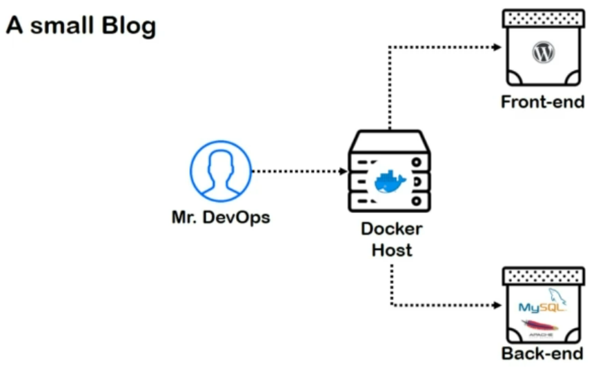
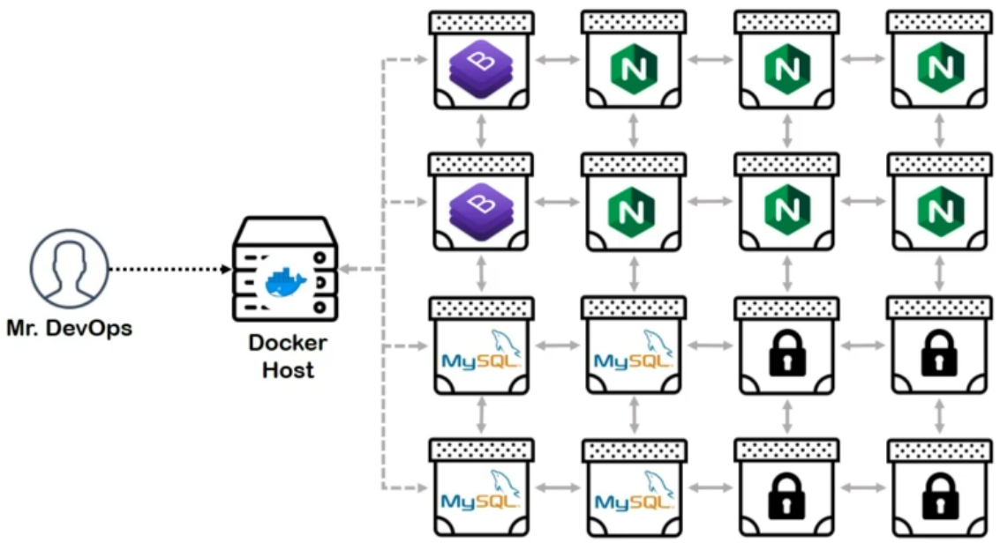
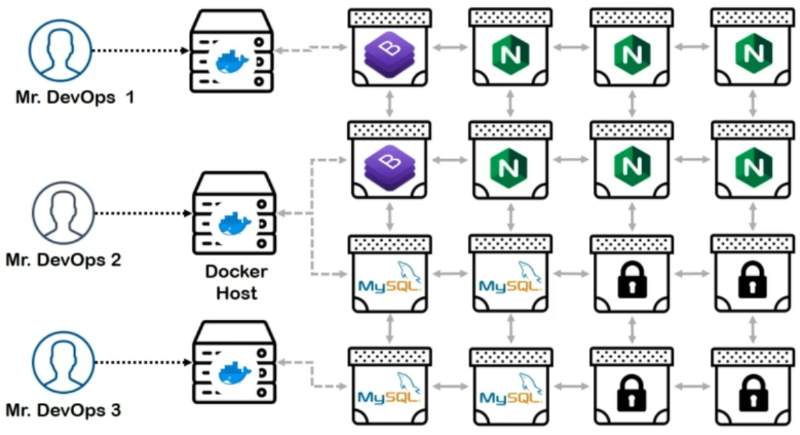
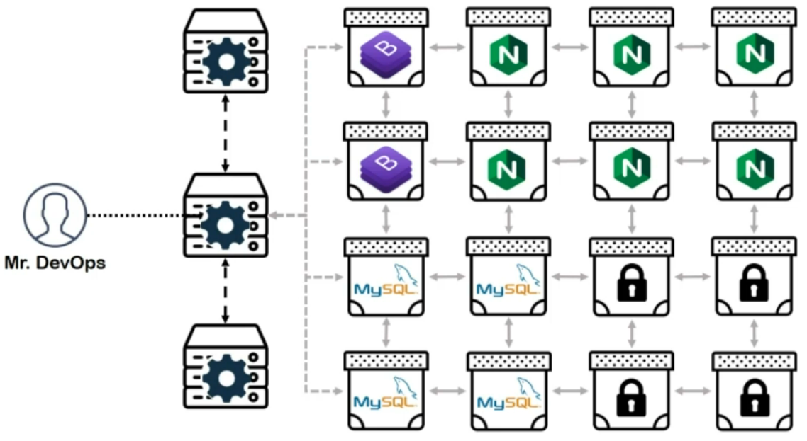
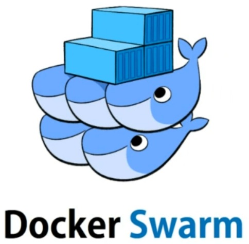
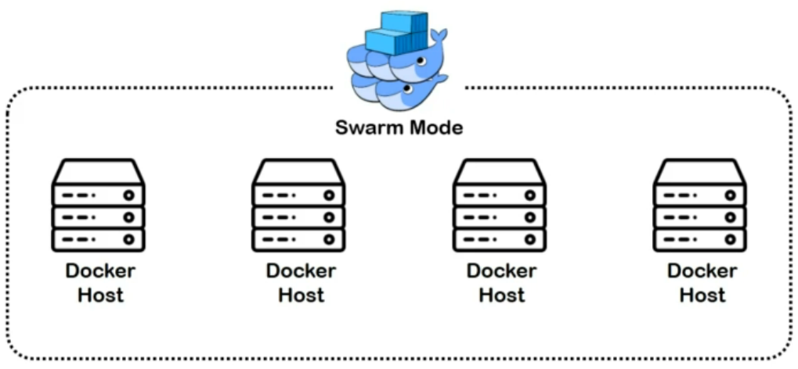
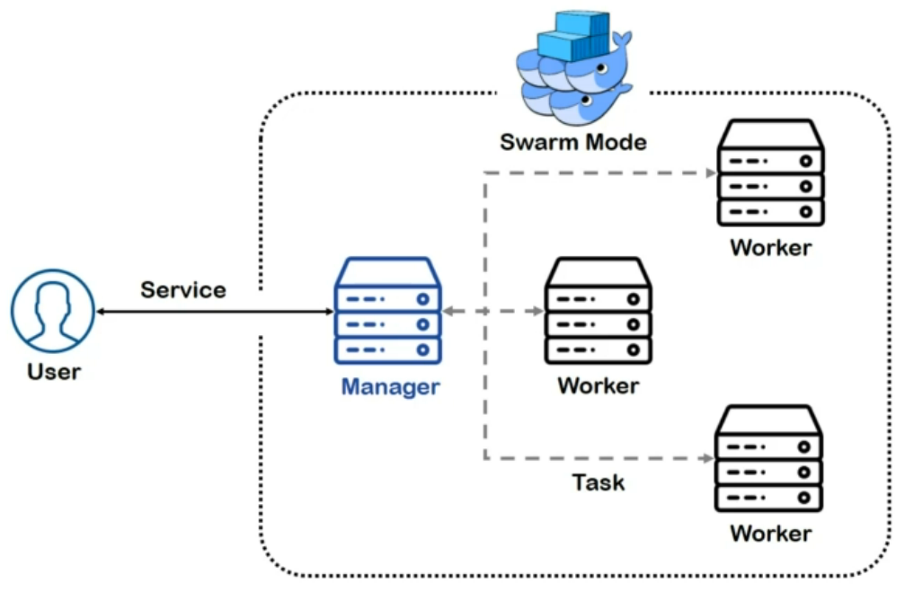
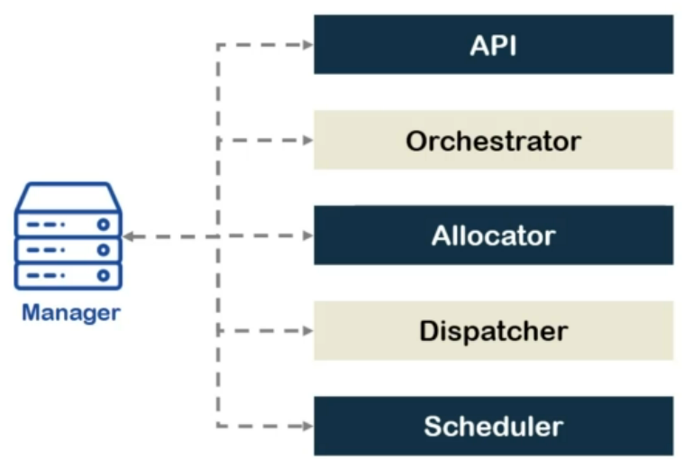
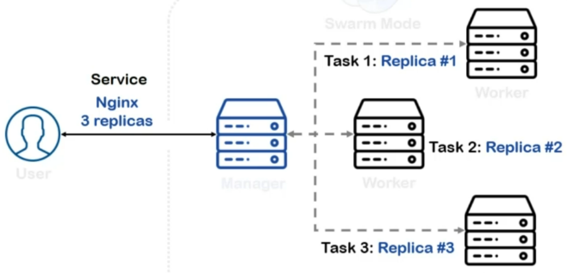

Till now, we have been revolving around containers on a single host. Single host would generally mean one machine or one VM.

They definitely have limited resources and it is totally fine as long as your purpose is to serve something not so resource heavy like a static landing page or a blog.

And one guy would be more than sufficient to manage it as well! But that's not the only application why we use containers.

There are giants like Google and Paypal who have millions of users a day! In their case, the amount of containers would be staggeringly high!

And they all may have to communicate in any topology at a given point of time.

In fact, even if we don't focus on such large applications, a dynamic website keeping track of visitors and collecting data from their actions would also need way more containers than usual blog!

Let's see even if we did manage to deploy all of these containers on the same host somehow, but we might run out of resources any time! Or due you to that the performance may be affected severely.

Plus, if the host goes down, our site is doomed for sure.

What should we do then?

Well, a simple solution would be deploying them on more than one host and get them managed by more than one DevOps engineers.

Sounds fancy! but they would all be eternally scattered and to make sure they remain in sync, we may have to run another set of micro-services in the backend.

Plus, hiding more people for doing the same task would also be less economic and none of the individuals would get opportunities and growth they deserve.

So, what to do then?

Well, it seems like we need someone who can make all of these hosts collaborate and allow us to manage them simultaneously from a single instance.

Kind of like a cluster!

In fact, exactly like a cluster of docker hosts! This way our containers will be in sync, their performance won't be reduced due to resource scarcity.

They can be managed from a single end point.

We can even think of replicas and backups of our containers for the cases where one or some of our hosts may go down and life will be happy! but who is that someone?

> A Container Orchestrator is a tool used to provision, schedule, and manage containers at large scale or one or more clusters of multiple hosts.

As we have mentioned before while Docker ecosystem has many offerings, some of them being less significant than the other ones.

It has three major tools which should be learned by every container enthusiast. We have already seen docker engine and docker compose.

The next stop at our journey of learning containers is the orchestrator developed and provided by docker called **"Docker Swarm"**.

The idea and implementation are pretty simple here. We take a set of docker hosts and connect them using swarm mode.

One of these hosts manually initializes the cluster and becomes the **"manager"** of the cluster.

The manager provides a key which can be used by other nodes to join the cluster.

Once the joined the manager, they become **"worker"** nodes.

The analogy is pretty self-explanatory here.

We as users communicate with the manager and the manager communicates with the workers. Quite like a management hierarchy of an industry actually.

Just like docker compose, we demand our actions in form of a service which manager translates into smaller tasks and provides them to workers to get handled. To do all of this, manager is equipped with a set of useful tools such as **"HTTP API end point"** which makes it capable of serving

our service request and creating objects out of those services. **"Orchestrator"**, which process tasks translated from services to workers. **"Allocator"**, which allocates internal clusters' IPs to the workers and manager itself. **"Dispatcher"**, which decides which node will server which task and gives this information to the orchestrator. And finally, **"Scheduler"**.

The task provided by orchestrator are idle. They don't run as soon as they get allocated. Scheduler signals workers to run the task which they have received, and so it also decides which task will run first and which won't. As for workers, they're pretty simple compared to manager.

They have two key components in total. "Worker" which connects to the dispatcher of the master to check if it has any task to receive from the orchestrator and "Executor", which literally does what its name suggests.

It executes the tasks, which means it creates containers, volumes, networks, and runs them.

You may have noticed that docker hasn't been the most creative firm as far as naming the tools is concerned since swarm is an "orchestrator" which has a component called "orchestrators" running on its manager. And worker has a component called "worker"! We can't change this but what we can make sure that we don't get confused by it.

So, in this course, whenever we refer to orchestrator and worker we will indicate orchestrating tool in general and worker nodes.

If we want to address the internal components instead, we will call them out specifically.

Just like every other topic, we also have a bunch of hands-on demos for swarm, but to understand how deploying

containers on a cluster is different from deploying them on a single host, take this example.

Let's say we have a service which needs 3 replicas of nginx containers hosting the same content.

Once we provide the service to the manager, it divides this into three smaller tasks and allocates one task to each worker.

So, all of the workers would be hosting one instance of nginx web-server container.

With that said, by now you might even be wondering about what would happen if swarm faces failure?

In other words, what if one or more nodes go down?